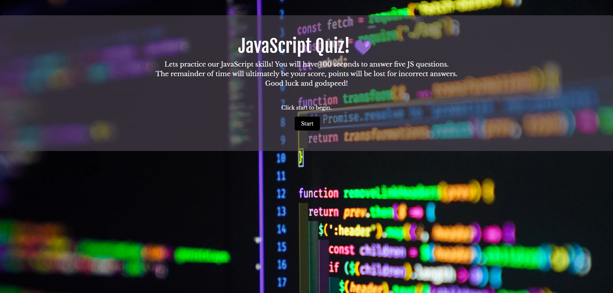

# Code Quiz Challenge 
## Description: 
Short, beginner's JavaScript quiz that is timed and scored on accuracy and speed. 

## Usage:

- Click the "Start" button to begin taking the quiz. 
- Once the user starts the quiz, a timer starts counting down from 100. 
- Every time the user answers a question incorrectly, time is deducted from the timer, leaving you with less points since your score is equal to the amount of time left in the timer. - This means the user must answer these questions correctly and quickly if they hope to achieve a high score. 

No one has been able to get a perfect 100 - who's up for the challenge?

## Links:
[Github Repo](https://github.com/Ale-Miret/code-quiz)  
[Deployed Page](https://ale-miret.github.io/code-quiz/) 